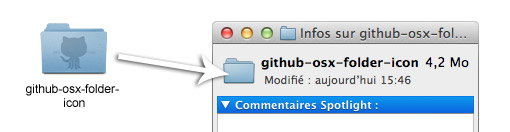

#Github MacOS X folder icon

To be honest, this is probably not gonna change the world...

#How to use
* Select a folder
* press Cmd+i or use right clic + "More infos"
* Drop "github-osx-folder-icon" folder on icon in the top left corner of the infos window.

You're done!

#License
Seriously?!

#Credits
Please do not give me any credit for this, this is pure monday morning procrastination and i'm already ashamed...